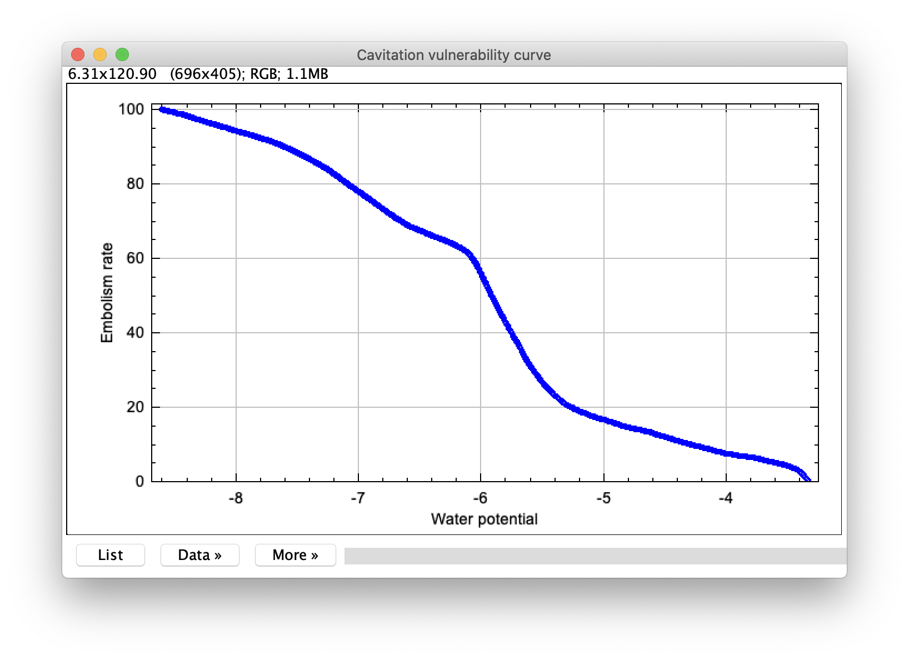

# Auto Embolism Detection

Development of an automatic tool for the detection of leaf embolism areas in plants using the `Fiji` image processing application.

## Installation
---
The following files completes the OSOV plugin and needs it to work.

1. First you need to install `Fiji` application 

    https://fiji.sc/

2. Then you need to install the `OSOV` plugin [here](https://github.com/OpenSourceOV/imagej-scripts/archive/master.zip).

    In the `Fiji` directory...

    * Put the `OSOV` folder in the plugins directory (e.g. `c:\Fiji\plugins\OSOV`)
    * Put the `OSOV Toolbox.ijm` in the `macros/toolsets` folder (e.g. `c:\Fiji\macros\toolsets\OSOV Toolbox.ijm`)

    On macOS systems the easiest way to get to the `Fiji` application folder is to go to `Applications` in `Finder` (usually accessible from the Favorites list on the left panel) and right-click the `Fiji.app` and click `Show Package Contents`.

3. Then, put the first file [OSOV_Auto_Embolism_Detection.ijm](/OSOV_Auto_Embolism_Detection.ijm) into `Fiji/plugins/OSOV` application folder.

4. And put the second file [OSOV_Auto_Vulnerability_Curve.ijm](/OSOV_Auto_Vulnerability_Curve.ijm) into `Fiji/plugins/OSOV` application folder.

4. Finally, restart `Fiji` load the `OSOV Toolbox` by clicking on the two rafters (`>>`) and you will find the `Auto Embolism Detection` and `Auto Vulnerability Curve` plugins into the `OSOV Toolbox` by clicking on the green box.

## Instructions
---
### Auto Embolism Detection

1. Import the image sequence `File > Import > Image Sequence` and make sure that the `Convert to 8-bit Grayscale` box is checked. 

2. Click on the green box and run the `Auto Embolism Detection`.

3. You have to choose the better threshold algorithm in the `Threshold` window you want to use depending on the quality of the acquisition. You can scroll through the images.

    We have selected some efficient thresholding methods on the proposed datasets:

    - `IsoData`
    - `IJ_IsoData`
    - `Moments`
    - `Li`

    When you found the most efficient algorithms, click on `Apply`.

    You will now have a `Convert Stack To Binary` window, where you need to put the method that you chose previously.
    
    Make sure that the `Background` mode is on `Dark` and run `OK` and close the `Threshold` window after the conversion was done. 
    (If you a see black & red images after closing the `Threshold` window, they will become black & white again in step 5).

    
4. You can view the result by scrolling through the images in the stack.

5. To go to the next step, press the `space bar` of your keyboard.

6. This new step is for remove the noise from the images. It uses `Remove Outliers` function.

    You can choose the `Radius` size in pixels and make sure that the parameter `Which outliers` is on `Dark`. You can check the `Preview` box to see the result in real time.

7. You can view the result by scrolling through the images in the stack. If the noise reduction is not effective enough, you can try additional operations such as:

    - **Morphological operators:** `Process > Morphology > Gray Morphology` and choose an opening operator.
    - **Minimum Filter:** `Process > Filters > Minimum`.
    - **Median Filter:** `Process > Filters > Median`.
    - **Gaussian Blur:** `Process > Filters > Gaussian Blur` on the basic images.
    - ...

8. After processing on the image stack, you can save it as `TIFF` format and start measurements.

### Auto Vulnerability Curve
9. After image processing, you have to start measurements to calculate the vulnerability curve. To do that, click on the green box (`OSOV Toolbox`) and run the `Auto Vulnerability Curve` plugin.

10. When the measurements are done, you will have the possibility to save the measurements in a `csv` file.

11. Then, you have to import the `csv` file where water potentials have been measured and are present in the `WP_MPa` column of the `csv` file (Bilan). Make sure that the column name is `WP_MPa` and that the data in each row of the `csv` file is separated by a semicolon (`;`).

12. The final curve representing the cavitation vulnerability curve is calculated and displayed on the screen.

## References
---

- https://github.com/OpenSourceOV/image-processing-instructions/blob/master/instructions.md
- https://github.com/OpenSourceOV/analysis-instructions/blob/master/instructions.md
- Brodribb, T. J., Bienaimé, D., & Marmottant, P. (2016). Revealing catastrophic failure of leaf networks under stress. *Proceedings of the National Academy of Sciences*, 113(17), 4865-4869
- W. Tsai. Moment-preserving thresholding : a new approach. 1995.
- Picture thresholding using an iterative selection method. *IEEE Transactions on Systems, Man, and Cybernetics*, 8(8):630–632, 1978.
- C. Li and P. Tam. An iterative algorithm for minimum cross entropythresholding. *Pattern Recognit*. Lett., 19:771–776, 1998

## Contact
---
Researchers:
---
- Aurélie BUGEAU (LaBRI) <aurelie.bugeau@labri.fr>
- Régis BURLETT (INRAe) <regis.burlett@u-bordeaux.fr>

Students:
---
- Johan DAVID (Université de Bordeaux) <johan.david@etu.u-bordeaux.fr>
- Léo SOUVAY (Université de Bordeaux) <leo.souvay@etu.u-bordeaux.fr>
- Jon STARK (Université de Bordeaux) <jon.stark@u-bordeaux.fr>
- Théo VIDEAU (Université de Bordeaux) <theo.videau@etu.u-bordeaux.fr>
